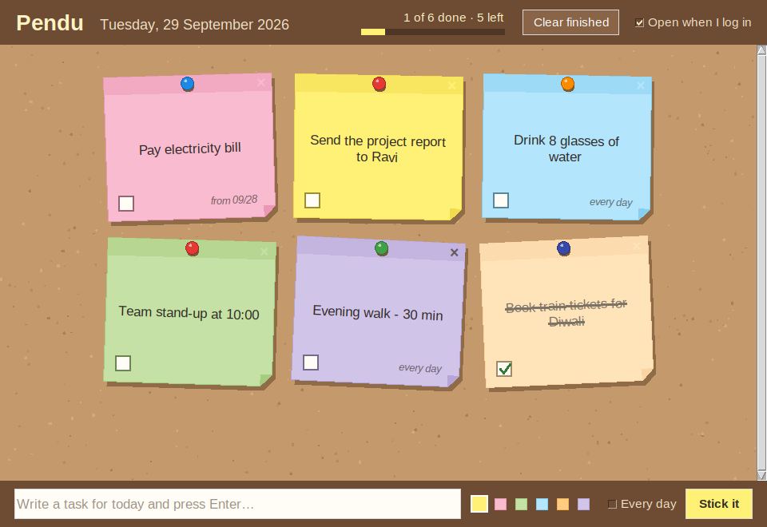

# Pendu 📌

Your tasks for today, pinned to a cork board as sticky notes. They pop up when you open your laptop.



- **Opens at login.** The board opens as soon as you sign in to your computer.
- **Opens when you wake the laptop.** Pendu keeps running in the background. When you open the lid after sleep, the board comes back to the front.
- **A new board every morning.** At midnight the board switches to the new day and shows itself again.
- **Tick things off.** Click a note to check it. It fades and gets crossed out, and the header shows how many are done.
- **Nothing gets forgotten.** A task you didn't finish stays on the board the next day, marked *from MM/DD*, until you check it.
- **Every-day tasks.** Tick **Every day** when you add a note, for things like "Drink water". It comes back unchecked each day.

## Requirements

Python 3.8 or newer with Tkinter. Nothing else needs to be installed.

| OS      | Tkinter                                                    |
|---------|------------------------------------------------------------|
| Windows | Included with the python.org installer                     |
| macOS   | Included with the python.org installer (`brew install python-tk` for Homebrew Python) |
| Linux   | `sudo apt install python3-tk` (Debian/Ubuntu) or `sudo dnf install python3-tkinter` (Fedora) |

## Run it

```bash
git clone https://github.com/jaisudhakar/pendu-reminder.git
cd pendu-reminder
python pendu.pyw        # on Windows you can also just double-click pendu.pyw
```

The first time it runs, Pendu sets itself to **open when you log in**. You can switch that off with the checkbox in the top-right corner, or from the command line:

```bash
python -m pendu --install-autostart   # open at login
python -m pendu --remove-autostart    # stop opening at login
```

Where the login entry goes:

- Windows: `Pendu.vbs` in your Startup folder
- macOS: `~/Library/LaunchAgents/com.pendu.reminder.plist`
- Linux: `~/.config/autostart/pendu.desktop`

If you move the `pendu-reminder` folder, turn the login option off and on again so it points to the new place.

## Using the board

| Do this                                | To                                             |
|----------------------------------------|------------------------------------------------|
| Type in the bottom bar + **Enter**     | Stick a new note (choose a colour first)       |
| Click a note                           | Check / uncheck it                             |
| Double-click a note                    | Edit its text                                  |
| Right-click a note                     | Menu: colour, repeat every day, remove         |
| Hover a note and click **×**           | Remove it                                      |
| **Clear finished**                     | Remove finished one-off notes                  |
| Close the window                       | Minimises it; Pendu keeps watching for wake-up |

Only one copy of Pendu runs at a time. Launching it again brings the existing board to the front.

Notes are saved in `~/.pendu/notes.json`. Set the `PENDU_HOME` environment variable, or pass `--data FILE`, to keep them somewhere else.

## Development

```bash
python -m unittest discover -s tests -t .
```

Code layout:

- `pendu/store.py`: tasks, the day rules (carry-over and every-day tasks), and the JSON file
- `pendu/app.py`: the Tkinter cork board, wake-from-sleep detection, and single-instance handling
- `pendu/autostart.py`: registering Pendu to open at login on Windows, macOS and Linux
